***
<h2 align=center>中山大学数据科学与计算机学院</h2>
<h2 align=center>移动信息工程 - 人工智能</h2>
<h2 align=center>本科生实验报告</h2>
<h6 align=center>(2017-2018学年秋季学期)</h6>


|教学班级|专业（方向）|学号|姓名|
|------ | ------ |--|--|
|1513(M3)|移动信息工程（互联网）|15352296|苏家明


## 一、实验题目
文本数据集的简单处理

## 二、实验内容
### ①抽取有用数据
思路：前两个函数是检查一个“词条”是否含数字（前一个使用any的方法，后一个使用正则表达式），用来除去没用的词条
</br>
最后一个函数是通过构造一个二维列表，把有用信息都放在里面，以及一个一维列表，按照出现顺序放置所有单词
```
# any方法检查单词是否含数字
def hasNum1(string):
    return any(char.isdigit() for char in string)

#正则表达式检查是否含数字
def hasNum2(string):
    return bool(re.search(r'\d',string))
```
```
def substract_data():
    f = open('semeval','r')
    line = f.readline()
    #存放数据的一级列表
    data_list = []

    #key code-------------------------------
    # 逐行读取文件
    while line:
        #把词条拆分出来
        line = line.split()
        #存放有用的词条（除去编号、情感因素）
        tmp = []
        for i in range(len(line)):
            if not hasNum2(line[i]):
                tmp.append(line[i])
        data_list.append(tmp)
        line = f.readline()
        # 按顺序存放不重复的词条
        words = []
        for i in range(len(data_list)):
            for j in range(len(data_list[i])):
                if data_list[i][j] not in words:
                    words.append(data_list[i][j])

    #-------------------------------------

    f.close()
    # print(data_list)
    # 返回每一行的词条、所有不重复的词条、总行数
    return data_list,words,len(data_list)
```

### ②计算one-hot矩阵
思路：因为前面做了一点数据预处理，所有现在只需要跑一个两重循环，把每个出现在第n个文本的词条标记为1,就可以了
为了方便输出，把one-hot矩阵每一行输出都合并成一个字符串了，开array也是可以的，但是懒。
```
def cal_one_hot(data,words,row):
    output = sys.stdout
    one_hot = open('one_hot','w')
    sys.stdout = one_hot

    #key code----------------------------------
    #result记录整个矩阵，每一行为一个string
    result = []
    for i in range(row):
        string = ""
        for j in range(len(words)):
            if words[j] in data[i]:
                string = string + "1 "
            else:
                string = string + "0 "
        result.append(string)
    for i in range(len(result)):
        print(result[i])
    #----------------------------------------

    sys.stdout = output
    one_hot.close()
    print('done1')
```
### ③计算tf矩阵
思路：用一个字典统计每个文本词条出现与否以及出现的次数、总词数，然后一除就ok了。
```
def cal_tf(data,words,row):
    output = sys.stdout
    tf = open('tf','w')
    sys.stdout = tf

    #为了方便下一id―tf矩阵的运算，这里就把结果存在一个数组返回
    #key code------------------------------------
    array = [[0 for i in range(len(words))] for i in range(row)]
    #用字典数每一条文本词条出现的次数
    d = dict()
    for i in range(row):
        sum = 0;
        string = ""
        d.clear()
        for j in range(len(data[i])):
            d[data[i][j]] = d.get(data[i][j],0)+1
            sum = sum + 1
        for j in range(len(words)):
            array[i][j] = float(d.get(words[j],0))/sum
            string = string +str(array[i][j])+' '
        print(string)
    #----------------------------------------------

    tf.close()
    sys.stdout = output
    print('done2')
    return array
```

### ④计算tf_idf矩阵
思路：由于前面已经算好tf矩阵，这里只需要跑一个二重循环，然后字典记录每个词出现在每篇文章的次数即可
```
def cal_tf_idf(data,words,row,tf):
    output = sys.stdout
    tf_idf = open('tf_idf','w')
    sys.stdout = tf_idf

#keycode--------------------------------------------
    #字典统计每个词出现的文章数
    d = dict()
    for i in range(len(words)):
        for j in range(row):
            if words[i] in data[j]:
                d[words[i]] = d.get(words[i],0)+1

    #利用公式计算tf_idf矩阵
    for i in range(row):
        string = ""
        for j in range(len(words)):
            tf_idf_ij = tf[i][j]*math.log(float(row)/d[words[j]])/math.log(2)
            string = string + str(tf_idf_ij) + ' '
        print(string)
        string = ""

  #---------------------------------------------------
    tf_idf.close()
    sys.stdout = output
    print('done3')
```

### ⑤one_hot变三元（稀疏）矩阵

思路：用一个列表存稀疏矩阵，前三项分别为行列数和有效个数，后面每一项是一个存有效数的数值、行号、列号的列表
</br>
稀疏矩阵的行列数不变，非零数及其位置二重循环找出来
```
result = [];
  result.append(row)
  result.append(col)
  result.append(0)

  num = 0
  for i in range(row):
      for j in range(col):
          if not onehot[i][j] == 0:
              result.append([1,i,j])
              num = num + 1
  result[2] = num
```

### ⑥稀疏矩阵加法
思路：先把A矩阵复制出来为C，然后在B矩阵中找有没有位置与A矩阵中相同的，有则数值相加</br>
没有则插入到C矩阵中，且C矩阵有效数+1，最后根据行列号对C矩阵排序
```
def plus(a,b):
    c = a
    for i in range(b[2]):
        flag = False
        for j in range(a[2]):
            #存在行列好相同的数，相加
            if a[3+j][1] == b[3+i][1] and a[3+j][2] == b[3+i][2]:
                c[3+j][0] = a[3+j][0] + b[3+i][0]
                flag = True
        #新的有效数，插入到C，且C有效数+1
        if not flag:
            c.append([b[i+3][0],b[i+3][1],b[i+3][2]])
            c[2] = c[2]+1
    #根据行列号对C排序
    c[3:len(c)] = c_part
    return c
    c_part = sorted(c[3:len(c)],key=lambda x:(x[1],x[2]))
```

## 三、实验结果展示
### ①one_hot矩阵
下面是前10个文本的结果，one_hot矩阵记录的数量和顺序都与文本一致，第10行第一个"1"也表明了”happi“是前面重复的单词
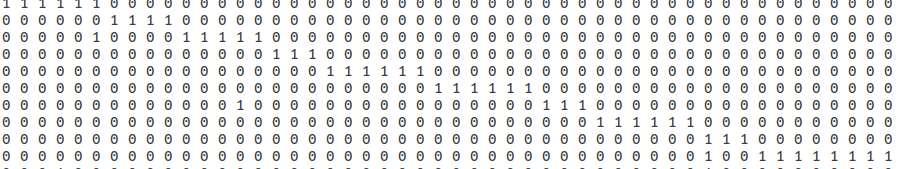
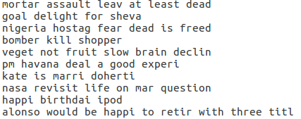
</br>下面是1个小例子，试一下极端case，文本词条没出现过和全部出现过，计算正确</br>
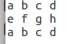
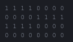

### ②tf矩阵
下面是一个例子的验证，正确</br>
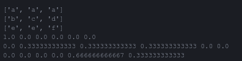</br>
下面是另外一个例子</br>
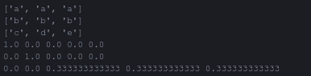</br>
下面是TA给的样例的前两行</br>
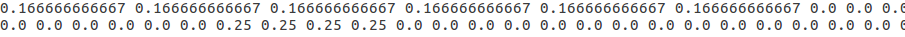</br>


### ③idf_tf矩阵
只有当所有词在所有文章都出现，才比较好肉眼验证，下图</br>
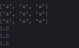</br>
另外一个情况,结果也符合预期</br>
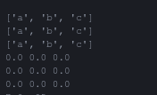</br>
因为log以2为底，弄一个4个文本的小数据，一种出现2次，一种出现1次</br>
出现1次的为 0.5×log（4/1）= 1 </br>
出现2次的为 0.5×log（4/2） = 0.5 </br>
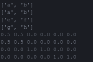</br>
最后截图Ta提供数据集的前两行</br>
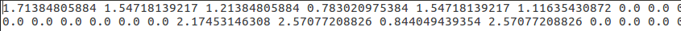 </br>

### ④one_hot转稀疏矩阵
先弄一个单位矩阵玩一下</br>
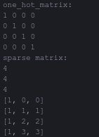</br>
随便再搞一个小矩阵</br>
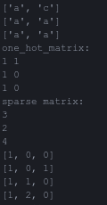</br>
惯例看一下样例的前几行</br>
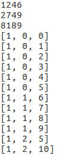</br>

### ⑤三元组加法
跑一个样例,加法和排序都没问题</br>
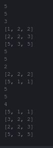

## 思考题
Q：为什么id矩阵有一种算法分母要加1
> 显然是怕出现除0的情况，然后我试了一下，但是想了一下，因为统计的词条至少都出现过一次，怎么会出现除0呢，然后想了一想，敲一个空行就出现了，因为我的计算是根据文本数量统计的，即便这个文本没有词条，也去算，然后就出现除0了。

Q：IDF和TF_IDF有什么意义？
>  IDF是逆向文件频率，统计的是一个词出现在不同文章的次数，假如idf大的话说明这个词出现的文章不多，因此具有区分度，可以使用这个词作为分类的特征，或者搜索的权重，而tf_idf因为多乘了一个tf，所以与词条出现在文章的频率成正比，个人认为作用和idf类似，tf是衡量一个词条对该文本的重要性的指标，所以tf_idf对长短文出现同一个词做出了区分，因为长文出现一个词条和短文出现一个词条的重要性显然是不一样的，区分度也显然不一样，因此个人认为tf_idf作为分类的特征更加优秀。

Q：为什么用三元组代表稀疏矩阵
> 显然是因为稀疏矩阵很浪费空间，三元组是方便在、直观、节省空间的储存方式啊！
