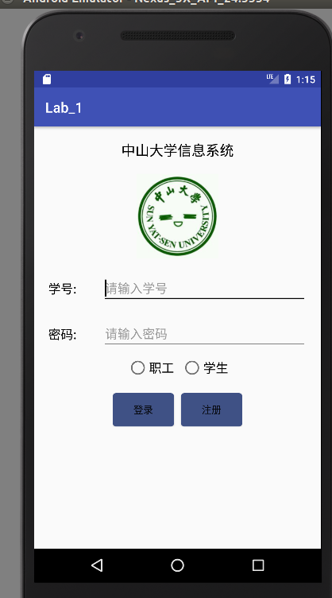

<h1 align=center> 实验一 </h1>

## 嵌入式系统导论实验报告
-------

|  姓名  |  学号  |  班级  |  电话  |  邮箱  |
| :--: | :--: | :--: | :--: | :--: |
|  苏家明    | 15352296     | 1513（M3）      | 13247666264     |921181549@qq.com|

-----

### 1.实验题目
* 实验题目：基本UI设计
* 实验要求：只使用一个约束布局
* 实验目的：
    1. 熟悉android studio的基本操作
    2. 熟悉Android studio的UI设计

### 2.实验结果

##### 总体效果

### 3.实验心得
